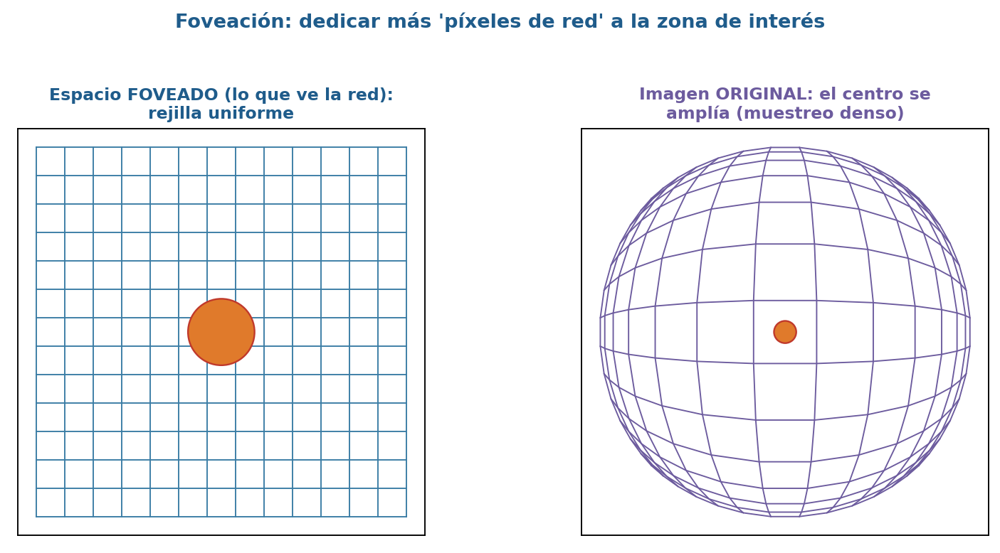
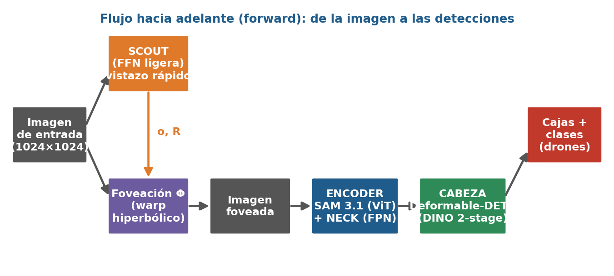

# Telescope — Hyperbolic Foveation for Drone Detection

A drone detector that **"zooms in" on what matters** before looking, based on the paper
*"Telescope: Learnable Hyperbolic Foveation for Ultra-Long-Range Object Detection"*
(Ewen et al., 2026 · [arXiv:2604.06332](https://arxiv.org/abs/2604.06332) ·
[project page](https://light.princeton.edu/telescope)).

---

## The idea in 1 minute

A faraway drone is just a handful of pixels — too few for a detector to recognise. Instead of
making the whole image bigger (expensive), we copy a trick from **the human eye**: your eye only
sees sharply in the centre (the *fovea*) and blurry at the edges, so you move your eyes to put
what matters in the centre.

We do the same to the image with a **"lens"** (a differentiable warp): it spends more pixels on
the region of interest and squashes the rest.



The lens has only **2 knobs**:

- **`o`** — *where* to look (the centre of the lens)
- **`R`** — *how much* to magnify (the radius / zoom)

A tiny network (the **"scout"**) looks at a small version of the image and predicts `(o, R)`;
the lens warps the image; a frozen **backbone** extracts features; a **DETR head** turns those
into boxes. Everything is differentiable, so the scout *learns where to aim* from the detection
error.



> A longer, slide-by-slide explanation (in Spanish, for a mixed audience) is in
> **`Foveacion_Hiperbolica_Drones.pptx`**. The notebooks below build the whole thing from scratch.

---

## Install

```bash
git clone <repo> && cd hyperbolic_foveation_telescope_learn
./install.sh            # interactive: venv + deps + backbone + (optional) data + self-test
```

Or by hand:

```bash
python -m venv .telescope && source .telescope/bin/activate
pip install --upgrade pip
pip install -r requirements.txt          # core: package + notebooks
pip install -e .
pip install -r requirements-train.txt    # extras: only for train.py / eval.py
```

The lightweight **EfficientTAM** backbone (used for drone training) and large model checkpoints
are not tracked by git — see the *Backbones & offline install* section below to set them up.

---

## How to run

### 1. Learn how it works (notebooks)

```bash
source .telescope/bin/activate && jupyter notebook
```

Six notebooks tell one story — *building a digital telescope* — and run on a laptop CPU
(notebooks 01–05 use tiny stand-in models; 06 analyses real results after training):

| # | Notebook | Step |
|---|---|---|
| 01 | `01_geometric_engine.ipynb` | The lens maths: Φ, Φ⁻¹, Jacobian |
| 02 | `02_foveation_warp.ipynb` | Warping the image (`grid_sample`) |
| 03 | `03_hyperbolic_embedding.ipynb` | Telling the detector the lens settings |
| 04 | `04_detection_head.ipynb` | Boxes, gIoU loss, denoising |
| 05 | `05_full_pipeline.ipynb` | The full model + Hungarian matching |
| 06 | `06_results_analysis.ipynb` | Metrics, by-distance plots, with/without foveation |

### 2. Train on a drone dataset (YOLO format)

Point `--data_dir`/`--val_dir` at the dataset **root** (it finds `train/` and `val/`).
Labels are `class cx cy w h` in `[0,1]`; images without a label file are background negatives.

```bash
torchrun --nproc_per_node=2 train.py \
    --dataset drones \
    --data_dir /path/to/drones_v5 --val_dir /path/to/drones_v5 \
    --backbone efficienttam --backbone_ckpt ./checkpoints/efficienttam_s.pt \
    --image_size 512 512 --batch_size 32 --epochs 60 --lr 2e-4 --fp16 \
    --output_dir ./runs/drones 2>&1 | tee runs/drones/train.log
```

Single GPU: drop `torchrun --nproc_per_node=2` and use `python train.py ...` with a smaller
`--batch_size`. Per-epoch metrics, `results.csv`, `results.png` and a `foveation:` diagnostic
line are written to `--output_dir`.

### 3. Evaluate

```bash
python eval.py --dataset drones \
    --data_dir /path/to/drones_v5 \
    --checkpoint ./runs/drones/checkpoint_best.pt \
    --image_size 512 512        # MUST match training resolution
```

> ⚠️ Always pass the **same `--image_size` you trained with**. The default (1024²) on a model
> trained at 512² feeds the backbone 4× the tokens it saw → near-zero mAP (a measurement
> artefact, not a real result).

---

## Making the foveation lens actually work (drone-specific)

On drone data the lens tends to **collapse** (it learns `R → 0`, i.e. "don't zoom") because the
default loss never rewards a large `R`, ~half the frames are empty, and a single global `o`
can't point at drones that appear anywhere. These flags counter that:

| Flag | Default | What it does |
|---|---|---|
| `--fov_spatial` | off | Predict `o` per-image via a soft-argmax heatmap (instead of a constant) |
| `--fov_empty_weight` | `0.0` | Weight of the empty-frame term. `0` = don't supervise the lens on no-drone frames |
| `--fov_w_r` / `--fov_r_lo` / `--fov_r_hi` | `1.0`/`0.05`/`0.40` | Pull `R` toward a **size-based target**: small drones ask for a bigger lens |
| `--fov_r_floor` / `--fov_w_floor` | `0.05`/`1.0` | Anti-collapse hinge that keeps `R` off zero |
| `--fov_warmup_epochs` / `--fov_warmup_R` | `3`/`0.3` | Hold `R` fixed & large early so the head learns to use zoom |
| `--fov_lr_mult` | `5.0` | Train the scout faster than the rest of the net |
| `--bg_keep_frac` | `1.0` | Keep only this fraction of background (no-drone) train images (e.g. `0.5`) |

Recommended drone run (add to the train command above):

```bash
    --fov_spatial --fov_warmup_epochs 3 --fov_warmup_R 0.3 --fov_lr_mult 5 \
    --fov_empty_weight 0 --bg_keep_frac 0.5
```

It is working if, in the `foveation:` log line, `fov/R_mean` stays well above 0, `fov/dist_to_gt`
drops below the static-centre baseline, and `fov/o_x_std` rises (proves `o` varies per image).

### Ablation: with vs without the lens

```bash
python train.py ... --no_foveation --output_dir ./runs/baseline   # R≈0 → Φ = identity
python compare.py --runs ./runs/baseline ./runs/drones --labels "No lens" "Telescope"
```

---

## Backbones & offline install

| `--backbone` | Encoder | Params | Use for |
|---|---|---|---|
| `efficienttam` | EfficientTAM ViT-S | ~22M | Edge / real-time, drone training |
| `sam3` *(default)* | SAM 3.1 ViT | 453M | Maximum accuracy (server) |

<details>
<summary><b>EfficientTAM backbone (lightweight)</b></summary>

```bash
git clone https://github.com/yformer/EfficientTAM       # or use the EfficientTAM/ in the repo
pip install -e EfficientTAM --no-build-isolation --no-deps
pip install hydra-core omegaconf iopath
python - <<'EOF'
from huggingface_hub import hf_hub_download
hf_hub_download(repo_id="yunyangx/efficient-track-anything",
                filename="efficienttam_s.pt", local_dir="checkpoints")
EOF
```

The editable install is **per-environment and not tracked by git**. On every machine you train
on you must (1) make `EfficientTAM/` present, (2) re-run `pip install -e EfficientTAM ...`,
(3) copy `efficienttam_s.pt` into `checkpoints/`. A good load prints
`[backbone] loaded 153 EfficientTAM encoder weights`.
</details>

<details>
<summary><b>SAM 3.1 backbone (gated — needs Meta approval)</b></summary>

Request access at https://huggingface.co/facebook/sam3.1, `hf auth login`, then:

```bash
git clone https://github.com/facebookresearch/sam3 && pip install -e sam3
python - <<'EOF'
from huggingface_hub import hf_hub_download
hf_hub_download(repo_id="facebook/sam3.1", filename="sam3.1_multiplex.pt", local_dir="checkpoints")
EOF
```
Public fallback while waiting: `pip install sam2` + `sam2.1_hiera_large.pt`.
</details>

<details>
<summary><b>Air-gapped server (no internet)</b></summary>

Pre-download wheels on a connected machine into `wheels_offline/`, rsync the repo (excluding the
non-portable `.telescope` venv), then:

```bash
pip install --no-index --find-links wheels_offline \
    hydra-core omegaconf antlr4-python3-runtime iopath portalocker
pip install -e EfficientTAM --no-index --no-build-isolation --no-deps
```

The server copy is a plain rsync (not a git repo); the package is `pip install -e .` so editing
source files takes effect live. Copy backbone checkpoints into `checkpoints/` separately.
</details>

<details>
<summary><b>Argoverse 2 (the original cars-on-highway dataset)</b></summary>

```bash
pip install av2
python -m av2.datasets.sensor.download --target_dir ./data/argoverse2
# train/eval with: --dataset argoverse2 --data_dir ./data/argoverse2/sensor/train
```
</details>

---

## Package structure

```
telescope/                  the importable package
├── geometry.py     Φ, Φ⁻¹, Jacobian                 ├── matcher.py    Hungarian + losses (incl. foveation loss)
├── warp.py         FoveationWarpLayer (the lens)     ├── estimator.py  FoveationEstimator (the scout, o & R)
├── embedding.py    HyperbolicEmbedding              ├── head.py       Riemannian box head + loss
├── box.py          Euclidean ↔ Riemannian boxes     ├── eval.py       COCO mAP evaluator
├── data_drones.py  DronesYoloDataset                 ├── data.py       Argoverse2Dataset
├── backbone_efficienttam.py / backbone_sam3.py       └── pipeline.py   TelescopeModel (full system)
notebooks/   the 01–06 learning path        train.py / eval.py / compare.py        install.sh
```

---

## Project status

This repo adapts Telescope to **drone detection** (single-class, YOLO data) on the
`dev_efficienttam_backbone` branch. Latest training (`et66`) reached **mAP50-95 ≈ 0.17**
(×4.5 over the first run); the foveation lens collapsed (`R → 0`), so the `--fov_*` flags above
were added to make it actually zoom. The longer-term direction is a counter-drone (C-UAS) system:
multi-class (drone/bird/airplane) + tracking + optical PTZ zoom.

## Citation

```bibtex
@article{ewen2026telescope,
  title   = {Telescope: Learnable Hyperbolic Foveation for Ultra-Long-Range Object Detection},
  author  = {Ewen, Parker and Rivkin, Dmitriy and Bijelic, Mario and Heide, Felix},
  journal = {arXiv:2604.06332},
  year    = {2026}
}
```
